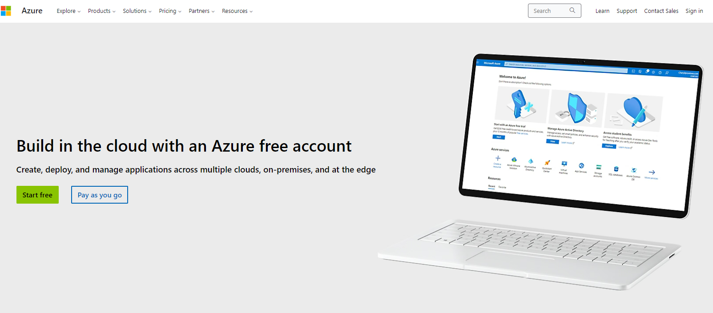
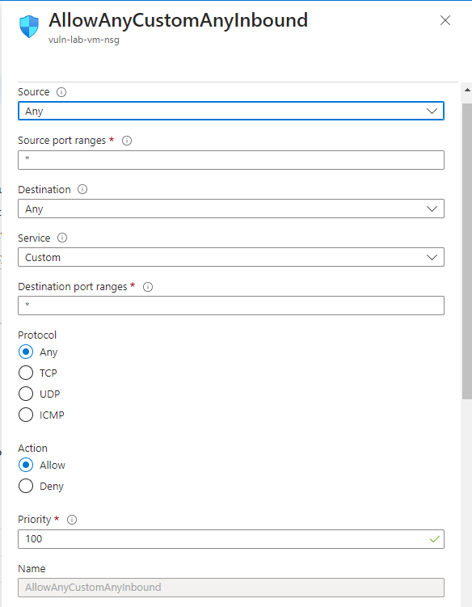
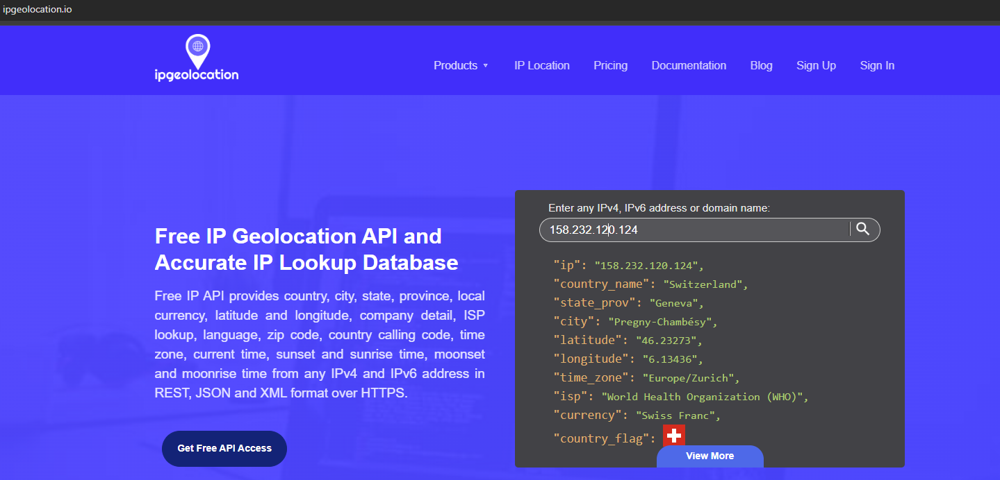
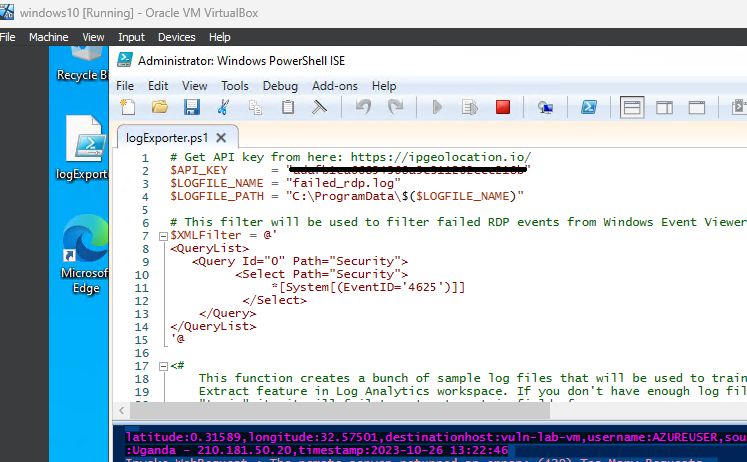
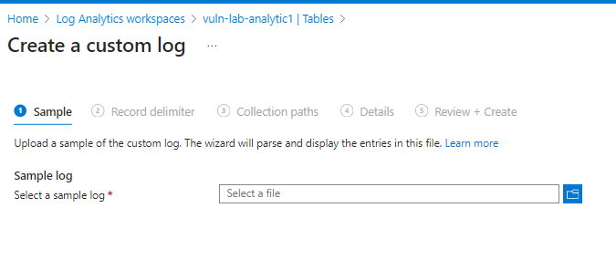
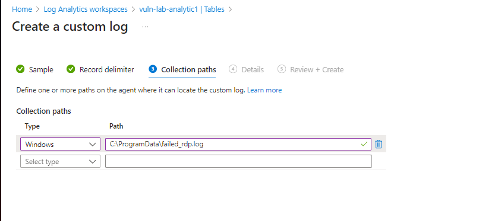
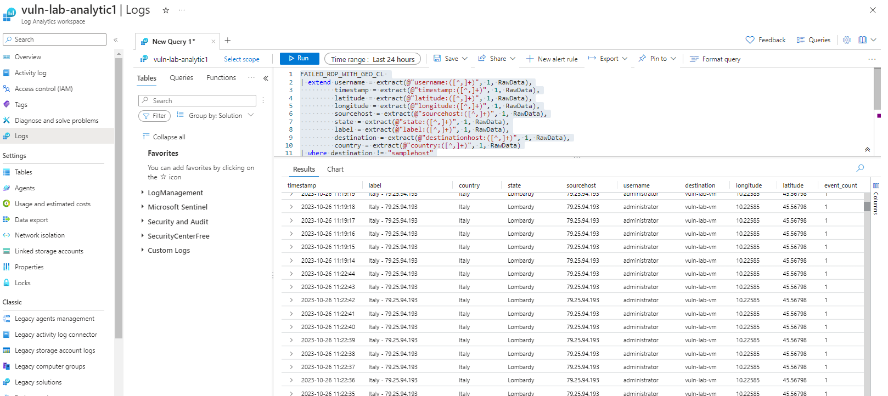
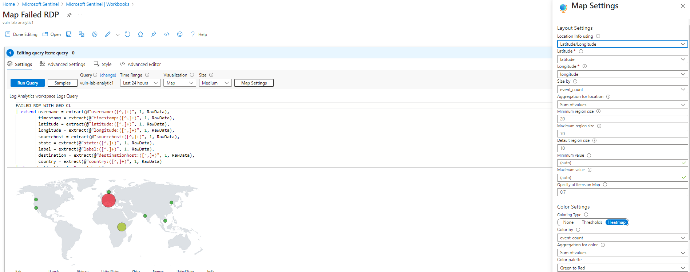

# Azure RDP Failed Login Map Monitoring

## Project Introduction

Welcome to a comprehensive guide on Azure RDP Failed Login Map Monitoring. In this project, my primary focus is working with Windows Event Logs using PowerShell, with a specific emphasis on monitoring failed RDP (Remote Desktop Protocol) login attempts.

## Creating Your Azure Account

Before diving into the technical details, ensure you have an Azure account. If you don't have one, you can easily sign up for a free account, which comes with a generous $200 credit for exploration.

## Building the Vulnerable Virtual Machine

The first step is to create a virtual machine made intentionally vulnerable by turning off the firewall. Follow these steps:

1. Create an Azure Virtual Machine with a Windows 10 operating system, setting up the administrator account and specifying a resource group for streamlined management.
2. During Network configuration, create a custom firewall rule to intentionally make the VM vulnerable.

## Setting Up Log Analytics

To effectively gather and analyze data from your VM, you'll need a log analytic workspace. Here's how to set it up:

1. Create a log analytic workspace and ensure it's in the same resource group as your VM.
2. Configure data collection within Microsoft Defender for Cloud, selecting your log analytic workspace and enabling "Servers" under Environment settings.
3. Click on Data Collection and choose "All Events"

## Configuring the Vulnerable VM

Return to the vulnerable VM and connect to it with the public IP address using RDP. Please note that Remote Desktop is not available on Windows 11 Home; it's a feature exclusive to Windows 11 Pro. To access your Azure VM from a Windows 11 Home system, you can use virtualization software such as VirtualBox or VMware Workstation to set up a Windows 10 virtual machine and connect to your Azure VM through it.

Ensure the firewall is turned off for the Domain Profile, Private Profile, and Public Profile.(Hit the windows key and write “wf.msc” to get to the firewall settings)

## Data Ingestion with PowerShell

Let's delve into data ingestion using PowerShell:

1. Sign up at ipgeolocation.io and obtain an API key.
2. Copy the PowerShell script from Josh Madakor's repository (https://github.com/joshmadakor1/Sentinel-Lab/blob/main/Custom_Security_Log_Exporter.ps1)
3. Open PowerShell ISE on your vulnerable VM and execute the provided PowerShell script, replacing the API key with the one you obtained.
4. This script will notify you in the PowerShell command line of any attempted connections to your vulnerable VM.

## Creation of Custom Logs

Creating custom logs in the Log Analytic Workspace is the next step:

1. Within the Log Analytics Workspace, select your workspace.
2. Under virtual machines, connect your VM to the workspace.
3. In the same menu, click "Tables" and then "Create," establishing a new custom log (MMA-based).
4. Configure the log to collect data from your VM by copying the contents of the "failed_rdp.log" file from your vulnerable VM to your local computer. The path to this file on your vulnerable VM is: C:\ProgramData\failed_rdp.log

5. Now click on logs and run this query:

<pre>
FAILED_RDP_WITH_GEO_CL 
| extend username = extract(@"username:([^,]+)", 1, RawData),
         timestamp = extract(@"timestamp:([^,]+)", 1, RawData),
         latitude = extract(@"latitude:([^,]+)", 1, RawData),
         longitude = extract(@"longitude:([^,]+)", 1, RawData),
         sourcehost = extract(@"sourcehost:([^,]+)", 1, RawData),
         state = extract(@"state:([^,]+)", 1, RawData),
         label = extract(@"label:([^,]+)", 1, RawData),
         destination = extract(@"destinationhost:([^,]+)", 1, RawData),
         country = extract(@"country:([^,]+)", 1, RawData)
| where destination != "samplehost"
| where sourcehost != ""
| summarize event_count=count() by timestamp, label, country, state, sourcehost, username, destination, longitude, latitude
</pre>

It might take up to 40 minutes before it shows any data. 

   

## Setting up the Map and Analyzing Data

Now, it's time to set up our SIEM:

1. Access Microsoft Sentinel and click create.
2. Add the workspace you created earlier
3. Click on workbooks and Add a workbook.
4. Click on edit and remove the sample diagrams.
5. Click on add, and then add query.
6. Add a query matching the one used in the custom logs.
7. Visualize the data on a map using specific settings as illustrated.
8. Save your configuration.

That's it! Each time someone attempts to connect to your vulnerable VM via RDP, the event will be plotted on your map.

## Important Note

Don't forget to delete all resources when you're finished to avoid consuming your Azure credits.

## In Conclusion

A special thanks to @JoshMadakor for sharing this fascinating project, which has not only enhanced my understanding of Azure but also my experience with Microsoft Sentinel.
